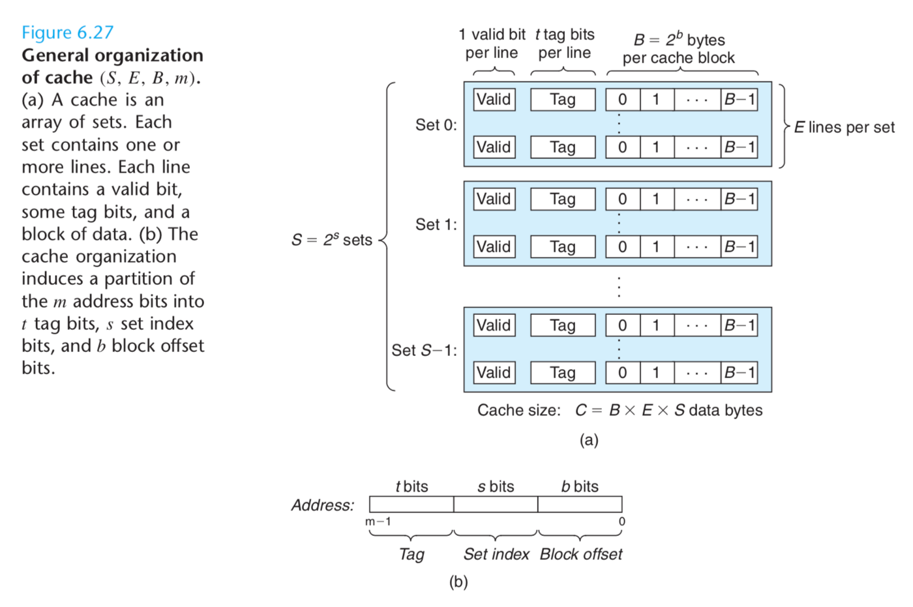

# cache_simulator

This is the part A cache lab from CSAPP

A cache simulator that simulate the "action" of a cache memory without actually storing any block information.

Evict cache line according to the Least Recent Used Cache (LRU) policy.

